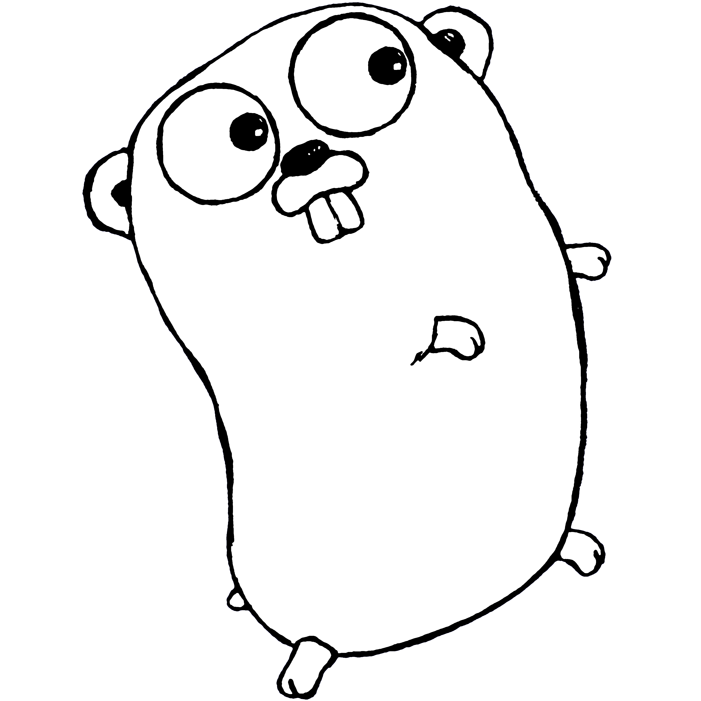

# Roadmap Belajar Go

## Fase pembelajaran

## 1. Fundamental
- Setup environment Go
- Sintaks, tipe data, control flow
- Slices dan maps (deep dive)

## 2. Intermediate
- Struktur package/module/workspace
- Testing dasar dan coverage
- File I/O dan JSON

## 3. Advanced
- Goroutine, channels, select
- Context dan cancellation
- Memory model + race detector

## 4. Expert
- Profiling dan tracing
- GC tuning dan PGO
- Fuzzing + integration coverage

## 5. Practice / Capstone
- Bangun mini REST API
- Terapkan test, race detection, dan profiling
- Review hasil dengan checklist

## Strategi belajar yang disarankan

1. **Belajar konsep** (baca materi).
2. **Implementasi kecil** (latihan 15-30 menit).
3. **Refleksi** (catat error/insight).
4. **Ulangi** sampai pola berpikirnya terbentuk.

