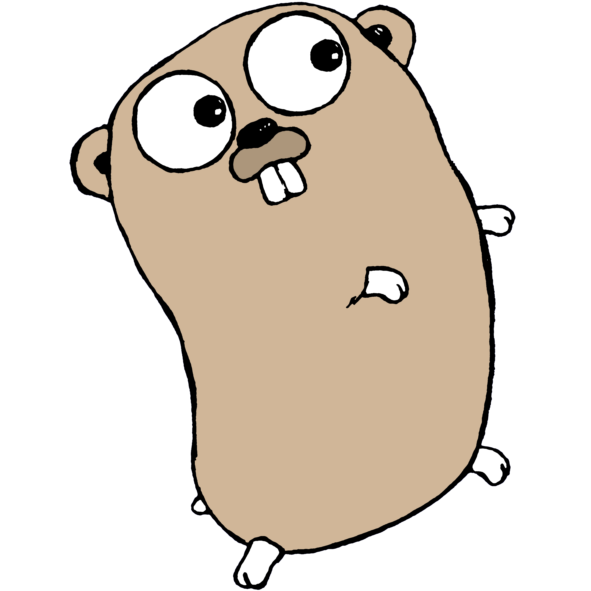

# BELAJAR GOLANG — Dari Dasar sampai Expert

Repo ini dibuat sebagai perjalanan belajar Go yang bertahap, dari nol sampai siap membangun aplikasi yang rapi dan production-minded.

## 🚀 Mulai dari sini (wajib untuk pemula absolut)

Kalau kamu benar-benar baru mulai, **mulai dari jalur fundamental dulu**:
**[01-fundamental/00-start-here.md](01-fundamental/00-start-here.md)**

Bagian ini disusun seperti perjalanan step-by-step:
- dari setup sampai menulis program dasar dengan percaya diri,
- latihan kecil berulang agar konsep menempel,
- fondasi low-level Go diperkenalkan **bertahap**, bukan sekaligus.

## Jalur belajar

| Level | Folder | Fokus | Rekomendasi |
|---|---|---|---|
| 0 | `00-roadmap.md` | Peta belajar keseluruhan | Baca dulu (5 menit) |
| 1 | `01-fundamental/` | Dasar bahasa Go + fondasi low-level bertahap | **✅ Jalur utama pemula** |
| 2 | `02-intermediate/` | Package/module, testing, I/O, JSON | Lanjut setelah level 1 selesai |
| 3 | `03-advanced/` | Concurrency, context, memory model | Setelah intermediate |
| 4 | `04-expert/` | Profiling, GC, PGO, fuzzing, coverage | Untuk optimasi lanjutan |
| 5 | `05-practice-capstone/` | Latihan bertingkat + capstone | Validasi kemampuan akhir |

## Cara pakai singkat

1. Baca dulu `00-roadmap.md` untuk melihat peta belajarnya.
2. Mulai dari `01-fundamental/00-start-here.md`.
3. Ikuti urutan fundamental sesuai navigasi: `01` → `08` → `99-referensi-fundamental.md` → `10-latihan-fundamental-dan-checklist.md`.
4. Pindah ke level berikutnya setelah checklist fundamental selesai.
5. Gunakan `REFERENCES.md` untuk pendalaman resmi.

## Target pembelajaran

- Paham sintaks dan idiom Go.
- Mampu menulis kode concurrent yang aman.
- Mampu menguji, menganalisis performa, dan mengoptimasi aplikasi Go.
- Siap membuat service Go yang production-minded.

## Catatan media

- Gambar pendukung ada di `assets/images/`.
- Atribusi, lisensi, dan sumber gambar dicatat di `ATTRIBUTION.md`.

